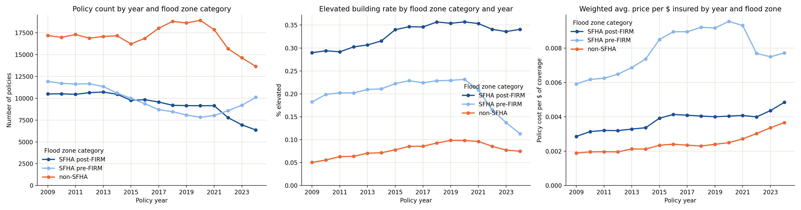
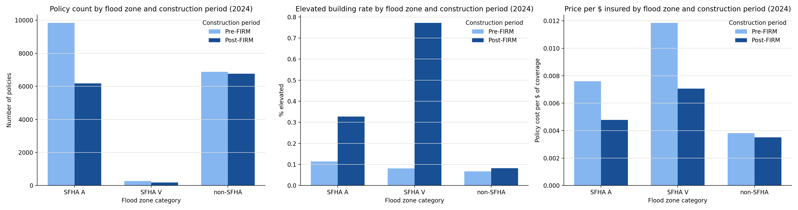

# Adaptation to Flood Risk Among NFIP Policyholders — Interpretation

Sample: single-family residential policies (`occupancyType` 1, 11), 1% sample of NFIP Redacted Policies v2, 2009–2024. "Adaptation" is proxied here by `elevatedBuildingIndicator` — whether the structure meets NFIP's technical definition of an elevated building (raised on piles/piers/columns/shear walls, no basement). `floodproofedIndicator` (dry/wet floodproofing as an alternative to elevation) was checked as a second adaptation channel, but it turns out to contribute almost nothing — see the data-quality note below.

## Background: reading the categories

**Flood zones.** `ratedFloodZone` is collapsed into three groups:
- **SFHA A** — Special Flood Hazard Area, riverine/inland flooding (1% annual chance of flood). Zones A, AE, A1–A30, etc.
- **SFHA V** — Special Flood Hazard Area, coastal *velocity* zones subject to storm-surge wave action. Much higher risk and much stricter building requirements than A zones (no solid foundation walls allowed — only open piles/piers/columns).
- **non-SFHA** — Zones B, C, D, X: moderate, minimal, or undetermined risk. No flood insurance purchase mandate, no elevation requirement.

**Pre-FIRM vs. post-FIRM.** A FIRM (Flood Insurance Rate Map) is the map that first defined a community's flood zones. Buildings started **on or before** December 31, 1974, or before the community's initial FIRM (whichever is later), are **pre-FIRM**: built with no flood-specific code requirement, so elevation is purely a voluntary/retrofit choice. Buildings started **after** that date are **post-FIRM**: elevation to or above Base Flood Elevation is a condition of the local floodplain ordinance, so "adaptation" here is largely baked in by code rather than chosen. This is the single most important distinction in the data — it separates *regulatory* adaptation from *voluntary* adaptation.

**Price per $ of coverage** (`policyCost / totalBuildingInsuranceCoverage`) is a rough, coverage-normalized price signal — how expensive insurance is per dollar insured, independent of home value.

**Risk Rating 2.0 (RR2.0).** FEMA's overhaul of how NFIP premiums are calculated, phased in for existing policies from October 2021 and for all new policies by April 2022. It replaced the old system — which set prices mostly off flood zone and a few structural categories, with large implicit cross-subsidies (older, high-value, or previously-underpriced properties often paid far less than their actuarial risk) — with individualized, risk-based pricing incorporating distance to water, elevation, flood type, and replacement cost. The practical effect was large premium increases for many previously underpriced policies (concentrated among pre-FIRM, high-value, and repetitive-loss properties), and it's the most likely explanation for several of the trend breaks visible around 2021–2022 below.

## What the time series shows (2009–2024)

**Policy counts.** Non-SFHA policies are the largest group throughout, rising to a peak around 2019–2020 (~18,900) before falling ~28% to 13,640 by 2024 — consistent with the well-documented nationwide decline in NFIP policies-in-force, accelerated by RR2.0 premium increases. SFHA post-FIRM policies decline steadily after 2013, and more sharply after 2021 (9,143 → 6,365 by 2024). SFHA pre-FIRM policies decline through 2020 as expected (pre-FIRM is a fixed, aging stock), but then **reverse and rise** from 2021 (8,015) to 2024 (10,102), overtaking post-FIRM for the first time in the series. This reversal is unusual — pre-FIRM stock shouldn't organically grow — and is worth treating as a flag rather than a confirmed finding: it may reflect a change in how `postFIRMConstructionIndicator` gets reported once rating shifted to RR2.0's individualized risk factors, rather than an actual shift in the housing stock. Worth checking directly (e.g., against `rateMethod = 'RatingEngine'` or `originalConstructionDate`) before treating it as substantive.

**Elevation rates.** SFHA post-FIRM plateaus around 33–36% from the mid-2010s onward — a large share of even post-FIRM stock isn't elevated in the strict pile/pier sense. SFHA pre-FIRM elevation rates rise gradually and plausibly from 18% (2009) to 23% (2018–2020) — a believable signature of voluntary retrofit — but then fall sharply, halving to 11.3% by 2024. Since a building can't "un-elevate," this drop is almost certainly compositional: it lines up with the pre-FIRM policy-count reversal above, suggesting a wave of newly-coded pre-FIRM policies with lower elevation rates entering the sample post-RR2.0, diluting the average rather than reflecting any real change in the existing stock. Non-SFHA elevation rates stay low throughout (5%→10%), as expected given no regulatory push.

**Floodproofing adds essentially nothing.** The natural hypothesis was that the "gap" in post-FIRM elevation rates (only 33–36% elevated, not close to 100%) is filled by floodproofing as a code-compliant alternative. A direct tally of `floodproofedIndicator` across the sample (single-family policies, all years) says otherwise: the field is almost never populated as `1` (and is frequently missing outright). This looks like a data-quality/reporting-coverage issue rather than evidence that floodproofing is genuinely rare.

**Price per $ coverage.** All three groups show a visible inflection around 2021–2022, consistent with RR2.0's rollout. SFHA post-FIRM and non-SFHA prices rise steadily through the period, with the RR2.0-era acceleration especially visible for post-FIRM (0.0040 in 2022 → 0.0048 in 2024). SFHA pre-FIRM is the most expensive category for most of the series and rises fastest pre-2021 (reflecting the pre-RR2.0 phase-out of legacy pre-FIRM subsidies under Biggert-Waters/HFIAA), but then **declines** slightly after 2021 (0.0096 → 0.0077) even as the other two groups keep rising — again consistent with the compositional shift flagged above rather than pre-FIRM policyholders actually getting cheaper insurance.

## What the 2024 cross-section shows

Three consistent patterns:
1. **Post-FIRM elevation rate exceeds pre-FIRM in every zone**, most dramatically in SFHA V (77% vs. 8%) — coastal velocity zones have banned solid foundations for post-FIRM construction since the 1970s, so this gap is almost entirely a code effect, not a behavioral one. This is the central caveat for the whole analysis: most of what this proxy measures is *when a house was built relative to a map*, not *whether an owner chose to adapt*.
2. **Risk gradient tracks elevation and price together**: SFHA V is both the highest-price and (for post-FIRM) most-elevated category, SFHA A is intermediate, non-SFHA is lowest on both. Price is consistently lower for post-FIRM than pre-FIRM within the same zone — elevated/code-compliant construction is cheaper to insure per dollar of coverage, as expected.
3. **SFHA V sample sizes are small** (188–270 in the 1% sample), reflecting how small a share of NFIP policies coastal high-velocity zones represent nationally. Estimates for this row should be treated as noisier than the others — worth checking against the full (non-sampled) table before leaning on them.

## Bottom line

The elevation-rate proxy mostly captures regulatory adaptation (post-FIRM code compliance) rather than voluntary retrofit, and it varies far more by *when a structure was built relative to its community's flood map* than by current price signals or recent trends. The one genuinely interesting voluntary-adaptation signal in the data — the rising pre-FIRM elevation rate through 2020 — is exactly the series that gets muddied by the post-2021 compositional shift, so any claim about voluntary retrofit trends should be checked against a construction-date-based (rather than post-FIRM-indicator-based) definition before being reported with confidence.

## Other variables worth adding
 
`elevatedBuildingIndicator` is a coarse, binary proxy. The schema has several fields that would sharpen or cross-check it:
 
- **`elevationDifference` / freeboard** (`lowestFloorElevation − baseFloodElevation`). A continuous measure instead of a binary one — lets you distinguish "elevated to the legal minimum" from "elevated well above it," which the indicator alone can't. This is probably the single best upgrade to the current analysis.
- **`elevationCertificateIndicator`, codes A–E.** This field actually encodes the *method* of adaptation directly: `A` = basement/subgrade crawlspace, `B` = fill or crawlspace, `C` = piles/piers/columns *with* enclosure, `D` = piles/piers/columns *without* enclosure, `E` = slab on grade. Codes C/D are a cleaner, more granular version of "elevated" than the boolean indicator, and separating C from D captures whether the space below is enclosed (relevant for both flood-vent compliance and possible under-reporting of `elevatedBuildingIndicator` itself).
- **`obstructionType`.** For buildings already flagged as elevated, this distinguishes clean, code-compliant elevation (e.g., `10` free of obstruction, `20`/`30` breakaway walls with no attached machinery) from elevation with compliance problems (e.g., `50`/`54` non-breakaway walls, machinery below BFE). Useful for a "quality of adaptation," not just presence/absence.
- **`basementEnclosureCrawlspaceType`.** A finished basement/enclosure (`1`) is a materially worse flood-risk configuration than a proper crawlspace with flood vents (`3`/`4`) — this field lets you separate those rather than treating "has an enclosure" as one undifferentiated category.
- **`grandfatheringTypeCode`.** Distinguishes policies rated as `2` (grandfathered because *built to code* at the time) from `3` (grandfathered via *continuous coverage* despite a later adverse remap). The latter is a case where a property's risk classification rose but the owner didn't necessarily adapt — a useful negative control against the "adaptation" narrative.
- **`rolloverTransferCode`.** Code `O` specifically flags policies where the holder proactively opted into Risk Rating 2.0 pricing before it was mandatory (available only through March 2022). This is directly relevant to the compositional-shift caveat above — filtering on or against this code would help disentangle "genuine behavior change" from "RR2.0 transition mechanics" in the 2021–2022 trend breaks.
- **`crsClassCode`** (community-level). Already discussed as the main community-scale adaptation signal — worth adding as a cross-tab dimension alongside individual-building measures, since a well-adapted community (low CRS class) can shift *pricing* independent of any individual owner's elevation choice.
None of these fix the core pre-FIRM/post-FIRM confound on their own, but `elevationDifference` and `elevationCertificateIndicator` in particular would let the next iteration of this analysis move from a binary "adapted or not" toward a graded measure of *how much* adaptation, which is likely to be both more informative and less sensitive to the RR2.0-era reporting shift than `elevatedBuildingIndicator` alone.