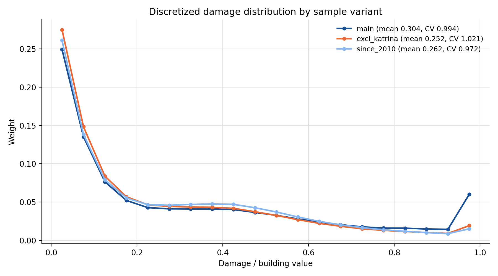
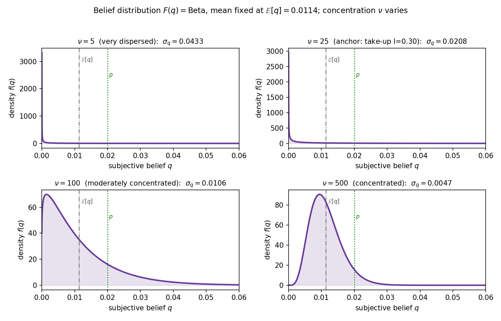

# Model Parameters — what we need to calibrate

*The **Value** column is what the **current findings actually used**; **Value (G&S)** is the
Gruber–Solomon (NBER WP 35408) estimate where one exists; **Source (G&S)** is how G&S identify it;
**Reasoning** says whether we adopt G&S and, if not, why. Continuous-damage parameters are folded into
§1b, tagged **[cont]**. §2 lists quantities that are **not model inputs** but are useful consistency
checks. Cross-refs: `draft/draft.tex`, `code/mvpf_discrete.py`,
`code/mvpf_continuous.py`, `lit/gruber_solomon.md`.*

---

## 1a. Structural / preference parameters
| Symbol | Meaning | Value | Source | Value (G&S) | Source (G&S) | Reasoning |
|---|---|---|---|---|---|---|
| $\gamma$ | CRRA risk aversion | 2 | Chetty (2006) | CARA $5\times10^{-4}$ | deductible-choice lit (Cohen–Einav, Sydnor), calibrated | **Not using G&S** — different functional form (CARA vs CRRA); implies implausibly high RRA at annual scale (flagged fragile in project notes). |
| $w$ | household wealth | 1 (normalized) | SCF/AHS | — | not estimated | **No G&S value.** Normalization; dollar scale cross-checked by G&S $\bar P,\,L_f$ ($w\approx\$195$k at $\bar d/w=0.15$). |

## 1b. Flood-risk / loss primitives  (discrete baseline + [cont] additions)
| Symbol | Meaning | Value | Source | Value (G&S) | Source (G&S) | Reasoning |
|---|---|---|---|---|---|---|
| $p$ | true annual flood probability | 0.02 | model calibration (see below) | ≈ 0.04–0.06 | *implied* from $\bar P/L_f$ (not directly reported) | **Not using G&S** — G&S report no single $p$; the implied value (≫ SFHA nominal 1%) reflects their higher-risk RR2.0 sample. Kept 0.02; flagged for reconciliation. |
| $\bar d=\mathbb{E}[D]$ | (mean) flood damage, share of wealth | 0.15 | NFIP claims / home value | \$29,267 ($L_f$) | NFIP loss data (loss given flood) | **Partially G&S** — $\bar d/w=0.15$ consistent with $L_f$ at $w\approx\$195$k. In the discrete model this scalar *is* the damage; in the continuous model it is the mean of $G$. |
| CV **[cont]** | coeff. of variation of $D$ ($=\sigma_D/\bar d$) | 0.86 (also ran 1.3) | chosen / NFIP claims | — | not estimated | **No G&S value** — the new dispersion dial; relief's tail-insurance value scales with it. |
| $D_{\max}$ **[cont]** | damage cap (share of wealth) | 1.0 (0.9 for CV=1.3) | modelling choice | — | not estimated | **No G&S value** — keeps CRRA marginal utility finite for heavy tails; max loss ≈ home value. |
| family **[cont]** | functional form of $G$ | Beta$(\alpha,\beta)$ on $[0,D_{\max}]$ | assumed (see below) | — | only scalar $L_f$ | **No G&S value** — G&S give the mean loss only; the *distribution* needs NFIP claims microdata. |

**Reading the y-axis (density).** $g(D)$ is a *probability density*, not a probability: the **area**
under the curve between two damage levels is the probability that damage falls in that range (total
area = 1). Height itself can exceed 1 (as here near $D=0$) because $D$ is measured in fine units
(share of wealth) — only *areas* are probabilities.

**Shape vs. CV — how the two relate, and where the numbers come from.** The *shape* is the full
functional form of $G$ (the whole density, including skew and tail); the *CV* is a single summary of
its spread. They are **not independent**: once we fix the **family** (Beta), the **support**
$[0,D_{\max}]$, and the **mean** $\bar d$, the CV pins down the two Beta parameters $(\alpha,\beta)$ —
so CV is the free *dial* and the shape is *derived*. Concretely CV = 0.86 ⇒ Beta$(1,5.67)$;
CV = 1.3 ⇒ Beta$(0.33,1.63)$ scaled to $[0,0.9]$. **These numbers are currently illustrative, not
estimated** — the Beta family is an assumption and CV = 0.86 is just the round default; a proper
calibration would fit $G$ to the **OpenFEMA NFIP redacted-claims** microdata (claim ÷ insured value:
compute its mean $\bar d$ and CV, or the full empirical distribution).

**Why a Beta for damages?** (i) It lives on a **bounded** interval — damage is a non-negative share of
wealth that cannot exceed total loss, matching $[0,D_{\max}]$; (ii) two parameters flexibly span
monotone, hump-shaped, and right-skewed forms; (iii) it maps cleanly onto (mean, CV), our two economic
targets; (iv) it has finite moments and a closed-form density, so the quadratures are stable.
*Caveat:* real NFIP claims may be fatter-tailed than a Beta allows — a lognormal, Gamma, or the raw
empirical distribution are natural robustness swaps.

**How $p$ is calibrated.** Currently $p = 0.02$ is a **round modelling choice**, set above the 1%
SFHA floor (the SFHA is the ≥1%-annual floodplain) to represent a somewhat-higher-risk insured
population — it is *not* yet rigorously estimated. Cleaner options, in increasing order of rigour:
(a) NFIP **claim frequency** (paid claims per policy-year) in the target zone; (b) **First Street /
FEMA flood-hazard-layer** return periods; (c) back it out from G&S, $p\approx\bar P/L_f\approx0.06$
(gross) or ≈0.04 net of ~30% loading. All three point *above* 0.02, so $p$ is a live reconciliation
item (and it rescales the belief mean $m=0.57p$).

## 1c. Policy parameters (status-quo evaluation point)
| Symbol | Meaning | Value | Source | Value (G&S) | Source (G&S) | Reasoning |
|---|---|---|---|---|---|---|
| $s$ | insurance subsidy rate | 0.47 | GAO (2023)/RR2.0 | ≈ 0.47 current ($s^*=52\%$) | NFIP premium data / sufficient-stat optimization | **Consistent with G&S** — current level matches; used 0.47. |
| $a$ | disaster-relief fraction | 0.055 | FEMA IA grant / avg claim | 0.133 ($f$) | FEMA spillover −\$216/house/1pp, IV = neighbor-county flood salience (county-flood panel 2010–) | **Not using G&S** — see note below. Kept IA-only 0.055. |

**Why not G&S's $a=0.133$ (yet).** Two problems with plugging it straight in: **(i) it bundles four
programs** — IHP (FEMA Individuals & Households grants; IA is its Individual-Assistance part), SBA
disaster **loans**, HMGP (Hazard Mitigation Grant Program), and GSE (Fannie/Freddie forbearance) —
whereas our 0.055 counts IA grants only. **(ii) It mixes benefit- vs cost-rate:** an SBA *loan* costs
the government ~13¢ per dollar (subsidy cost) but delivers far less than face value to the household
(they repay it), so the *fiscal cost rate* and the *household benefit rate* diverge. Our model's single
$a$ is **both at once** (household benefit = fiscal cost), so 0.133 — a fiscal-cost number — cannot
serve as the household-benefit rate. Hence "**reconciled, not averaged**": model each channel's benefit
and cost rate separately rather than splitting the difference. For now we kept the narrower IA-only
0.055.

## 1d. Behavioural / belief inputs
| Symbol | Meaning | Value | Source | Value (G&S) | Source (G&S) | Reasoning |
|---|---|---|---|---|---|---|
| $I$ | insurance take-up rate | 0.30 | FEMA / Dixon (high-risk) | 0.18 (risk-wtd); 0.05 (nat'l) | NFIP coverage counts | **Not using G&S** — 0.30 is high-risk/SFHA penetration (our target pop.); G&S's 0.18 is risk-weighted national. Depends on modeled population. |
| $\varepsilon$ | price elasticity of take-up | −0.32 | **G&S $\eta_q$** | −0.32 (−0.25 SFHA) | FOIA policy-level panel; within-policy variation from 18%/yr cap, contract FE | **Using G&S** — adopted as baseline (units-corrected), retiring old −0.17. |
| $m=\mathbb{E}[q]$ | mean belief | 0.0114 ($=0.57p$) | Bakkensen–Barrage $k_R$ | $0.57p$ ($k_R=0.57$) | Bakkensen–Barrage (2022) elicitation, adopted by G&S | **Using G&S convention** — G&S adopt the same $k_R=0.57$. Scales with $p$. |
| $\nu$ / $\sigma_q$ | belief concentration / dispersion | swept; empirical $\nu\approx15$–$41$ (anchor 25) | our parametrization | — | no belief distribution (uniform wedge only) | **No G&S value** — belief heterogeneity is our contribution (empirical value from Bakkensen–Barrage, below). |

**Functional form and the meaning of $\nu$.** The belief distribution is a **Beta**, parametrised by
(mean $m$, concentration $\nu$): $\alpha=m\nu,\ \beta=(1-m)\nu$, so $\nu=\alpha+\beta$. The mean is $m$
regardless of $\nu$; the dispersion is $\sigma_q=\sqrt{m(1-m)/(\nu+1)}$. Interpret $\nu$ as a
**"pseudo-sample size"**: it's *as if* beliefs were formed from $\nu$ prior observations — larger $\nu$
= more agreement = tighter distribution. "Swept" means we vary $\nu$ across the figures' x-axis; the
point-comparison tables are anchored at the empirical $\nu=25$ (which reproduces observed take-up).

| $\nu$ | $\sigma_q$ | belief distribution looks like |
|---|---|---|
| 5 | 0.043 | very dispersed — J-shaped, mass piled near 0 |
| **25** (anchor) | 0.021 | dispersed — take-up $I\approx0.30$ (empirical) |
| 100 | 0.011 | moderately concentrated — interior hump |
| 500 | 0.0047 | concentrated — tight bump below the mean |

**Empirical evidence for $\nu$ (Bakkensen–Barrage 2021).** Their door-to-door Rhode Island survey
($N=187$) elicits subjective flood beliefs directly, so its *spread* is the empirical counterpart to
$\nu$. From the paper: the elicited **10-year** flood probability has mean **0.21** (vs. actual 0.37),
with **35% of respondents perceiving ≤5%** (Tables A5–A6, Fig. 3). Fitting a Beta to
(mean $=0.21$, $F(0.05)=0.35$) gives $\text{Beta}(0.43,1.63)$ — strongly right-skewed. Converting to
annual, $q=1-(1-P_{10})^{1/10}$, the perceived **annual** belief has mean $\approx0.030$,
$\text{SD}\approx0.042$, **CV $\approx1.4$**. Mapping to our parametrization,
$\nu = m(1-m)/\sigma_q^2 - 1$:

| basis | $m$ | $\sigma_q$ | $\nu$ |
|---|---|---|---|
| B–B own mean | 0.030 | 0.042 | **15** |
| CV transferred to our mean | 0.0114 | 0.016 | **41** |
| B–B absolute SD at our mean | 0.0114 | 0.042 | 5 |

So **$\nu\sim10$–$40$, $\sigma_q\sim0.02$–$0.04$** — firmly **high heterogeneity**, squarely in the
relief-favoured / "both-used" region of the phase diagram. (We anchor the point tables at $\nu=25$,
within this range and reproducing observed take-up.) (This supersedes an earlier crude $\nu\approx130$ guess; the
*actual* elicited distribution shows even more dispersion.) *Caveats:* the elicitation is a noisy
10-year-horizon range question (heaping); perceived risk explains only $R^2=0.123$ of actual; and the
true annual $p$ is itself ambiguous in B–B (1.2% FEMA benchmark vs. 4.5% inundation-model), so treat
$\nu$ as order-of-magnitude.

*(Local MVPFs need only $(I,\varepsilon)$; global exercises need the full Beta $(m,\nu)$.)*

## 1e. Government / welfare
| Symbol | Meaning | Value | Source | Value (G&S) | Source (G&S) | Reasoning |
|---|---|---|---|---|---|---|
| $\lambda$ | marginal cost of public funds | 1.2 | **G&S** (Hendren–Sprung-Keyser range 0.5–2) | 1.2 | assumed (robustness check) | **Using G&S value.** |

**On $\lambda$.** The MCPF is the welfare cost of raising \$1 of public revenue (the deadweight loss of
taxation); standard values run ~1.0–1.5. We adopt **G&S's 1.2**. Note $\lambda$ enters **only** the
optimal-mix / phase-diagram exercises (it is the benchmark the optimal $(s^\ast,a^\ast)$ is scored
against); the **MVPF status-quo tables are $\lambda$-independent**. A higher $\lambda$ concentrates
optimal spending in the higher-MVPF instrument (relief), so at $\lambda=1.2$ the empirical-$\nu$ optimum
tilts toward relief (discrete: relief-only at $\nu=25$; continuous: relief-heavy mix). At the earlier
$\lambda=1.10$ the discrete anchor is instead an interior mix.

---

## 2. Consistency checks (not model inputs)

Quantities we do **not** feed into the model, but that let us test whether the calibrated
$(p,\bar d,s,a,I,\ldots)$ imply realistic magnitudes.

| Symbol | Meaning | Value (G&S) | Model analog | Model value | Verdict |
|---|---|---|---|---|---|
| $\bar P$ | average annual premium | \$1,739 | $p\,\bar d$ | **\$585** ($=0.02\times\$29{,}267$) | **~3× low** — matches G&S only at $p\approx0.06$; this *is* the $p$-reconciliation flag. |
| $\beta$ | FEMA ex-post \$ saved / house / 1pp coverage (cond. flood) | −\$216 (IV); −\$1,192/unit uncond. | $0.01\,\bar d\,a$ (cond.) | **\$16** ($a{=}0.055$) / **\$39** ($a{=}0.133$) | **5–13× low** — flat-fraction relief misses channels G&S captures (NFIP-payout offsets, GSE, correlated triggers), or units differ (per-house vs per-switcher). If the gap survives, the model **understates** relief's fiscal savings ⇒ *strengthens* the case for relief. |

Both checks come out **low**, and in instructive ways: the $\bar P$ gap is exactly the $p=0.02$-vs-G&S
tension (it closes at $p\approx0.06$), and the $\beta$ gap says our simple "relief = fraction $a$ of own
damage" understates the true federal spillover. Neither is a model input — $\beta$ in particular is the
*source* G&S use to back out $f\approx0.133$, so feeding both it and $a$ would double-count.

---

## Appendix — G&S values available for potential extensions
(not in the current model, ready to slot into roadmap extensions)

| Symbol | Meaning | Value (G&S) | Source (G&S) | Use |
|---|---|---|---|---|
| $\eta_m$ | mitigation/adaptation elasticity | 0.30–0.38 (FL); ≈0.075 reweighted | Florida Elevation Certificates, DiD | adaptation instrument $b$ (new-build margin) |
| $\eta_x$ | location/migration elasticity | −0.0077 | USPS tract-address panel, event study | sorting bound (defers two-region model) |
| admin loads | NFIP vs FEMA overhead | 30% of premiums vs 13% of assistance | NFIP / FEMA program accounts | benefit/cost wedge; tilts MVPF toward relief |
| $k_F$ | aid over-perception | 1.5 | Bakkensen–Barrage elicitation | perceived-vs-actual relief wedge $a_{\text{perc}}\ne a$ |
| intensive margin | coverage-amount elasticity | ≈ 0 (~1%) | FOIA policy-level panel | justifies binary insurance choice |
| reclassification risk | premium-risk SD (2070) | \$1,842; 50%-subsidy value \$207 | NFIP universe × 40 climate scenarios | a channel we deliberately do **not** model |
