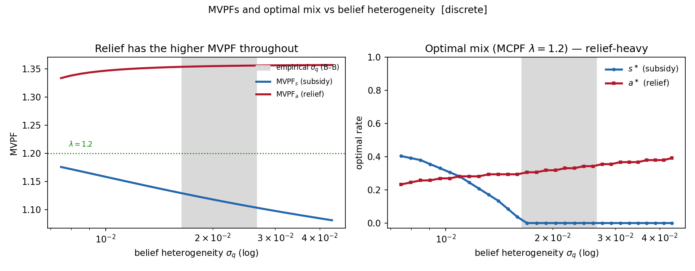
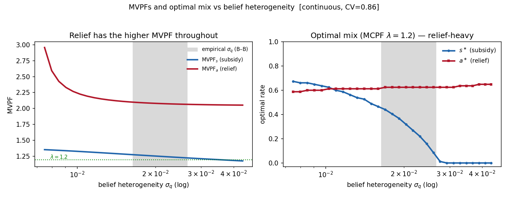

# MVPF Computations — formulas, results, and the optimal policy mix

## Headline: at empirically-grounded beliefs, the marginal public dollar favors **disaster relief**

*Self-contained MVPF writeup for the flood-policy model: how MVPF$_s$ (subsidy) and MVPF$_a$ (relief)
are computed, the parameters plugged in, a worked example, the resulting MVPF values by belief
concentration $\nu$, and the implied **optimal policy mix** $(s^\ast,a^\ast)$. MVPF formulas verified
numerically against `draft.tex` (value-function and deep-parameter forms). Parameters:
`model_parameters.md`. The (secondary) complements-vs-substitutes diagnostics are on the
`mvpf-complementarity` branch (`mvpf_complementarity.md`).*

---

## 0. Setup

One-period, one-region model (draft.tex). Households with wealth $w$ face flood probability $p$ and
damage $d$; they differ in subjective probability $q\sim F$. The government has two instruments — an
insurance **subsidy** $s$ (insured pay $(1-s)pd$) and a **disaster-relief** fraction $a$ (uninsured
flood victims receive $a\,d$). A household insures iff $q>q^\ast(s,a)$; take-up $I=1-F(q^\ast)$. We
evaluate each instrument by its **MVPF** (marginal welfare gain per dollar of fiscal cost), and — using
the MCPF $\lambda$ as the benchmark — solve for the optimal mix.

---

## 1. Utility and structural objects (discrete damage)

CRRA utility, $\gamma=2$:
$$u(c)=\frac{c^{1-\gamma}}{1-\gamma}=-\frac1c,\qquad u'(c)=c^{-\gamma}=\frac1{c^2}.$$

Consumption in each state (wealth normalized $w=1$):
$$c_I = w-(1-s)\,p\,d,\qquad c_{U,N}=w,\qquad c_{U,F}=w-(1-a)\,d.$$

Utility loss from an uninsured flood, and the take-up threshold belief:
$$\Delta u = u(c_{U,N})-u(c_{U,F}),\qquad q^\ast=\frac{u(c_{U,N})-u(c_I)}{\Delta u}.$$

A household insures iff its belief $q>q^\ast$. Note $q^\ast$ depends only on $(s,a)$ and the
structural parameters — **not on the belief distribution**.

## 2. Belief distribution

$q\sim\text{Beta}(\alpha,\beta)$, parametrized by mean $m$ and concentration $\nu$:
$$\alpha=m\nu,\quad\beta=(1-m)\nu,\quad \sigma_q=\sqrt{\tfrac{m(1-m)}{\nu+1}}.$$
Take-up and marginal density:
$$I=1-F(q^\ast)=1-I_{q^\ast}(\alpha,\beta),\qquad f(q^\ast)=\text{Beta pdf at }q^\ast,$$
where $I_{q^\ast}$ is the regularized incomplete beta (CDF). The empirical dispersion (from
Bakkensen–Barrage) is $\nu\approx15$–$41$, anchored at $\nu=25$ (which reproduces the observed ~30%
take-up).

## 3. Take-up responses (draft eqs. dI_s / dI_a)

$$\frac{\partial I}{\partial s}=\frac{f(q^\ast)\,p d\,u'(c_I)}{\Delta u},\qquad
\frac{\partial I}{\partial a}=-\frac{f(q^\ast)\,q^\ast d\,u'(c_{U,F})}{\Delta u}.$$

## 4. MVPF formulas (value-function form, draft eqs. mvpf_s_vf / mvpf_a_vf)

With internality $\;(V_I-V_U)=(p-q^\ast)\Delta u\;$ and $pd\equiv p\cdot d$:
$$\boxed{\;\text{MVPF}_s=\frac{(p-q^\ast)\Delta u\cdot\frac{\partial I}{\partial s}+pd\,u'(c_I)\,I}
{pd\,I+pd\,(s-a)\frac{\partial I}{\partial s}}\;}$$
$$\boxed{\;\text{MVPF}_a=\frac{(p-q^\ast)\Delta u\cdot\frac{\partial I}{\partial a}+pd\,u'(c_{U,F})\,(1-I)}
{pd\,(1-I)+pd\,(s-a)\frac{\partial I}{\partial a}}\;}$$

- Numerator = **internality correction** $+$ **direct benefit** (transfer to recipients).
- Denominator = **direct fiscal cost** $+$ **fiscal externality** of switchers $(s-a)$.

## 5. Continuous-damage modification

Only the damage side changes ($d\to D\sim G$, mean $\bar d$; $G=\text{Beta}(1,5.67)$ on $[0,1]$,
CV $=0.86$):
$$c_I=w-(1-s)p\bar d,\quad c_{U,F}(D)=w-(1-a)D,\quad
\Delta u=u(w)-\mathbb{E}[u(c_{U,F}(D))].$$
Define $\overline{Du'}\equiv\mathbb{E}[D\,u'(c_{U,F}(D))]$. Then $\partial I/\partial s$ uses $\bar d$,
$\partial I/\partial a=-f q^\ast\overline{Du'}/\Delta u$, the relief direct benefit is
$\partial V_U/\partial a=p\,\overline{Du'}$, and $u'(c_{U,F})$ in MVPF$_a$ is replaced by
$\overline{Du'}/\bar d$. All $pd$ become $p\bar d$.

---

## 6. Parameter values used

| Symbol | Meaning | Value | Note |
|---|---|---|---|
| $\gamma$ | CRRA | 2 | Chetty |
| $w$ | wealth | 1 | normalized |
| $p$ | flood probability | 0.02 | model calibration |
| $d$ ($\bar d$) | damage / wealth | 0.15 | NFIP claims (mean of $G$ in continuous) |
| $s$ | subsidy rate | 0.47 | status quo (GAO) |
| $a$ | relief fraction | 0.055 | status quo (FEMA IA) |
| $\varepsilon$ | take-up elasticity | −0.32 | G&S (sets $f(q^\ast)$ in the fitted-Beta variant) |
| $m$ | mean belief | 0.0114 $=0.57p$ | Bakkensen–Barrage $k_R$ |
| $\nu$ | belief concentration | **swept** | empirical $\approx15$–$41$; anchor $25$ (reproduces observed take-up) |
| CV | damage dispersion | 0.86 | continuous only |
| $\lambda$ | MCPF | 1.2 | Gruber–Solomon (enters only the optimal mix, §10) |

Full parameter documentation (values used vs. G&S estimates, sources) is in `model_parameters.md`.

**Structural objects at the status quo** (identical for every $\nu$):

| | $c_I$ | $c_{U,F}$ | $\Delta u$ | $q^\ast$ | $u'(c_I)$ | $u'(c_{U,F})$ | $(p-q^\ast)\Delta u$ |
|---|---|---|---|---|---|---|---|
| **discrete** | 0.99841 | 0.85825 | 0.16516 | 0.00964 | 1.00319 | 1.35760 | 0.001711 |
| **continuous** | 0.99841 | — (random) | 0.19676 | 0.00809 | 1.00319 | $\overline{Du'}/\bar d=2.0468$ | 0.002343 |

($pd=p\cdot d=0.02\times0.15=0.003$; continuous $\overline{Du'}=0.30701$, $p\bar d=0.003$.)

---

## 7. Worked example — discrete, $\nu=25$

$\alpha=0.0114\times25=0.285,\ \beta=24.715$. At $q^\ast=0.00964$: $F(q^\ast)=0.7003\Rightarrow I=0.2997$,
and $f(q^\ast)=17.274$.

$$\frac{\partial I}{\partial s}=\frac{17.274\times0.003\times1.00319}{0.16516}=0.31476,\qquad
\frac{\partial I}{\partial a}=-\frac{17.274\times0.00964\times0.15\times1.35760}{0.16516}=-0.20536.$$

$$\text{MVPF}_s=\frac{0.001711\times0.31476+0.003\times1.00319\times0.2997}
{0.003\times0.2997+0.003\times0.415\times0.31476}
=\frac{0.0014406}{0.0012910}=\mathbf{1.116}.$$

$$\text{MVPF}_a=\frac{0.001711\times(-0.20536)+0.003\times1.35760\times0.7003}
{0.003\times0.7003+0.003\times0.415\times(-0.20536)}
=\frac{0.0025011}{0.0018452}=\mathbf{1.355}.$$

(Take-up $I=0.30$ at $\nu=25$ matches the observed NFIP penetration.)

---

## 8. MVPF results — DISCRETE damage, across $\nu$

Status quo $(s,a)=(0.47,0.055)$, $m=0.0114$. All rows share the §6 structural block.
**MVPF$_a>$ MVPF$_s$ throughout** — the marginal public dollar does more as relief.

| $\nu$ | $\sigma_q$ | $I$ | $f(q^\ast)$ | $\partial I/\partial s$ | $\partial I/\partial a$ | num$_s$ | den$_s$ | **MVPF$_s$** | num$_a$ | den$_a$ | **MVPF$_a$** |
|---|---|---|---|---|---|---|---|---|---|---|---|
| 5 | 0.0433 | 0.140 | 4.90 | 0.0894 | −0.0583 | 0.000574 | 0.000531 | **1.081** | 0.003403 | 0.002507 | **1.357** |
| **15** | 0.0265 | 0.244 | 11.95 | 0.2177 | −0.1421 | 0.001107 | 0.001004 | **1.103** | 0.002835 | 0.002091 | **1.356** |
| **25** | 0.0208 | 0.300 | 17.27 | 0.3148 | −0.2054 | 0.001441 | 0.001291 | **1.116** | 0.002501 | 0.001845 | **1.355** |
| **41** | 0.0164 | 0.354 | 23.98 | 0.4370 | −0.2851 | 0.001812 | 0.001605 | **1.129** | 0.002145 | 0.001584 | **1.354** |
| 100 | 0.0106 | 0.444 | 40.66 | 0.7410 | −0.4834 | 0.002605 | 0.002256 | **1.155** | 0.001436 | 0.001065 | **1.348** |
| 500 | 0.0047 | 0.599 | 90.54 | 1.6499 | −1.0764 | 0.004626 | 0.003852 | **1.201** | −0.000209 | −0.000138 | **1.518** |

*(Bold $\nu=15,25,41$ = empirical Bakkensen–Barrage range. At $\nu=500$ (far more concentrated than the
data support) the MVPF$_a$ denominator goes negative because crowd-out $\partial I/\partial a$ is large —
the ratio is still reported but the local linearization is strained there.)*

MVPF$_s$ is close to 1 because insured households retain nearly all their wealth; MVPF$_a$ is higher
because uninsured flood victims are poorer, so their marginal utility is larger. The ranking is
**robust across the empirical belief dispersion**, and the empirical $\nu$ also reproduces observed
take-up (the internal-consistency check).



**Who relief reaches — the low-belief tail.** Relief serves the uninsured, deep-underperceiving tail
($q<q^\ast$) — households that no affordable subsidy would pull into insurance. That tail grows with
belief heterogeneity: the fraction no *free* subsidy could reach ($F(q^\ast_{s=1})$) rises from 0.00
(concentrated beliefs) to 0.46 (dispersed). This is why relief keeps a role even when subsidies are
generous.


## 9. MVPF results — CONTINUOUS damage (CV=0.86), across $\nu$

| $\nu$ | $\sigma_q$ | $I$ | $f(q^\ast)$ | $\partial I/\partial s$ | $\partial I/\partial a$ | **MVPF$_s$** | **MVPF$_a$** |
|---|---|---|---|---|---|---|---|
| 5 | 0.0433 | 0.148 | 5.82 | 0.0890 | −0.0735 | **1.178** | **2.053** |
| **15** | 0.0265 | 0.264 | 14.12 | 0.2159 | −0.1783 | **1.226** | **2.065** |
| **25** | 0.0208 | 0.329 | 20.32 | 0.3107 | −0.2566 | **1.251** | **2.078** |
| **41** | 0.0164 | 0.394 | 28.00 | 0.4283 | −0.3536 | **1.276** | **2.099** |
| 100 | 0.0106 | 0.512 | 46.23 | 0.7072 | −0.5839 | **1.323** | **2.209** |
| 500 | 0.0047 | 0.738 | 85.95 | 1.3146 | −1.0854 | **1.377** | **1.651** |

Continuous damage lifts **both** MVPFs, relief far more. Across the empirical range MVPF$_s$ rises
**≈11–13%** (1.10→1.23 … 1.13→1.28) and MVPF$_a$ rises **≈52–55%** (1.36→2.07…2.10). The subsidy's
*direct transfer* is unchanged ($c_I,\,u'(c_I)$ use the mean $\bar d$), but MVPF$_s$ also runs through
the take-up margin, which does move: a larger $\Delta u$ (Jensen) lowers $q^\ast$ and enlarges the
internality $(p-q^\ast)\Delta u$. MVPF$_a$ rises more because relief additionally insures damage
*dispersion* ($\overline{Du'}/\bar d=2.05>u'(c_{U,F})$).

**Status-quo comparison at $\nu=25$:**

| | $q^*$ | $\Delta u$ | $I$ | MVPF$_s$ | MVPF$_a$ | ratio |
|---|---|---|---|---|---|---|
| discrete | 0.0096 | 0.165 | 0.300 | 1.116 | 1.355 | 1.21 |
| **continuous** | 0.0081 | 0.197 | 0.329 | **1.251** | **2.078** | **1.66** |

**Robustness — heavier damage tail (CV = 1.3).** Relief's value scales with the CV of $G$. Re-running
with CV = 1.3 (damage capped at 90% of wealth so CRRA utility stays finite; figures in
`figures_continuous_cv13/`), at $\nu=25$:

| status quo ($\nu=25$) | $q^*$ | $\Delta u$ | MVPF$_s$ | MVPF$_a$ | ratio |
|---|---|---|---|---|---|
| discrete | 0.0096 | 0.165 | 1.12 | 1.36 | 1.21 |
| continuous CV=0.86 | 0.0081 | 0.197 | 1.25 | 2.08 | 1.66 |
| **continuous CV=1.3** | 0.0059 | 0.269 | 1.51 | **4.95** | **3.28** |

A heavier tail more than doubles relief's MVPF again (2.08 → **4.95**). So relief's edge is, if anything,
**understated** at CV = 0.86, since real NFIP claims are often more right-skewed.



---

## 10. Optimal policy mix (MCPF $\lambda=1.2$)

The MVPFs above are independent of $\lambda$. To turn them into a policy recommendation, solve
$$(s^\ast,a^\ast)=\arg\max_{s,a}\ \big[\,S(s,a)-\lambda\,\text{cost}(s,a)\,\big],$$
with $\lambda=1.2$ (G&S) the benchmark against which spending is scored. A higher MCPF concentrates
spending in the higher-MVPF instrument, tilting the optimum toward relief.

| | DISCRETE | | | CONTINUOUS | | |
|---|---|---|---|---|---|---|
| $\nu$ | $s^\ast$ | $a^\ast$ | regime | $s^\ast$ | $a^\ast$ | regime |
| 5 | 0.00 | 0.39 | relief-only | 0.00 | 0.65 | relief-only |
| **15** | 0.00 | 0.35 | relief-only | 0.06 | 0.62 | both |
| **25** | 0.00 | 0.32 | relief-only | 0.30 | 0.62 | both |
| **41** | 0.01 | 0.30 | both | 0.46 | 0.62 | both |
| 100 | 0.29 | 0.27 | both | 0.61 | 0.61 | both |
| 500 | 0.46 | 0.00 | subsidy-only | 0.64 | 0.00 | subsidy-only |

At the empirical anchor $\nu=25$ (bold $\nu=15,25,41$ = Bakkensen–Barrage range), discrete damage puts
the marginal dollar **entirely in relief** ($s^\ast=0$); continuous damage keeps a relief-heavy interior
mix ($s^\ast=0.30,a^\ast=0.62$) because full-coverage insurance still covers the tail of $G(D)$ that a
partial relief fraction leaves exposed. *(At $\lambda=1.10$ the discrete anchor is instead an interior
mix, $s^\ast=0.35,a^\ast=0.63$; the MVPF tables are unaffected either way.)*

The optimal policy over $(\text{mean underperception},\,\sigma_q)$ is relief-favored across most of the
space — subsidy-only only for near-correct, tightly-concentrated beliefs. Our empirically-anchored point
sits firmly in the **relief-only / relief-heavy** region.


---

## 11. A note on complementarity (secondary)

We also asked whether the two instruments are formal *complements or substitutes*. The answer is a
**null / weak-substitutes** result and is **not** the headline:

- The welfare cross-partial $\partial^2 S/\partial s\,\partial a$ is **negative** (weak substitutes)
  across the empirical belief range.
- The welfare gain from optimally using **both** instruments, over the best single one, is
  **negligible** (order $10^{-5}$ of wealth, ≈\$1–2/household-year).

So the policy question is **which** instrument the marginal dollar should fund (answer: relief), and how
that depends on beliefs and the damage distribution — not a super-additive "complementarity" gain. The
detailed diagnostics and derivations are in `mvpf_complementarity.md` (on the `mvpf-complementarity`
branch).

---

## 12. Verdict

- **Relief-favored, robustly.** At current US policy and empirically-grounded beliefs, MVPF$_a>$ MVPF$_s$
  in every specification; at G&S's MCPF the optimal marginal dollar is **relief** (relief-only under
  discrete damage, relief-heavy under continuous).
- **Continuous damage strengthens this** — relief additionally insures damage dispersion, widening its
  MVPF advantage (more so with heavier tails).
- **Relief's distinctive role** is reaching the low-belief uninsured tail that subsidies cannot.
- The "complementarity" question is a secondary null (weak substitutes, negligible blend gain).

## 13. Open next steps

- Reconcile the relief calibration $a$ (IA-only 0.055 vs G&S's bundled $f\approx0.133$) — a larger $a$
  raises both the benefit and the fiscal cost of relief; rerun the ranking.
- Adopt G&S loss/premium anchors ($L_f,\bar P$) and the implied higher $p$; recheck take-up validation.
- Fit $G$ to OpenFEMA claims microdata (mean + CV) rather than the illustrative CV=0.86.
- Belief identification (over-identification via Mulder's information effect; contamination-share).

---

## 14. How to reproduce

The MVPF core modules, the optimal-mix module, and the figure/table driver are all on `main`.

```python
import sys; sys.path.insert(0, "code")
import mvpf_discrete as D, mvpf_continuous as C     # cores
import mvpf_optimal_mix as A                        # optimal_mix, welfare, cost

D.mvpf(D.S0, D.A0, D.M_REF, nu=25)      # -> (MVPF_s, MVPF_a) = (1.116, 1.355)
C.mvpf(C.S0, C.A0, C.M_REF, nu=25)      # -> (1.251, 2.078)
A.optimal_mix(D, D.M_REF, nu=25, lam=1.2)   # -> discrete optimal (s*, a*) at the anchor
```

Or run `python code/mvpf_reproduce.py` for all tables and the figures in
`figures/`, `figures_continuous/`, and `figures_continuous_cv13/`.
