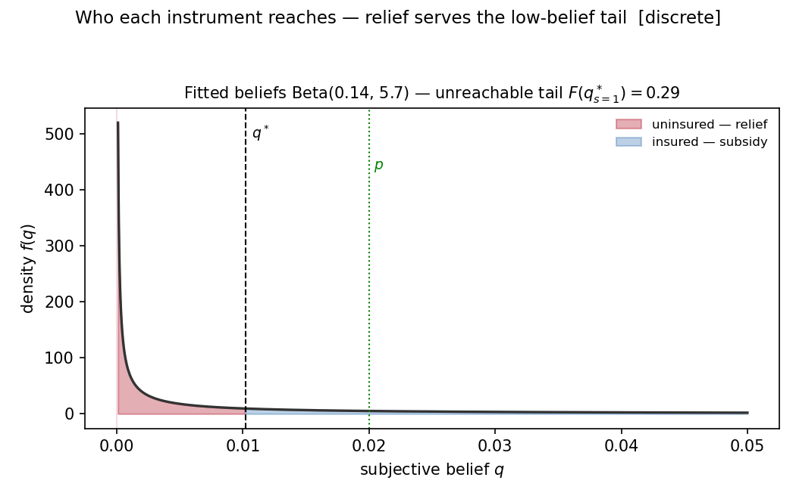
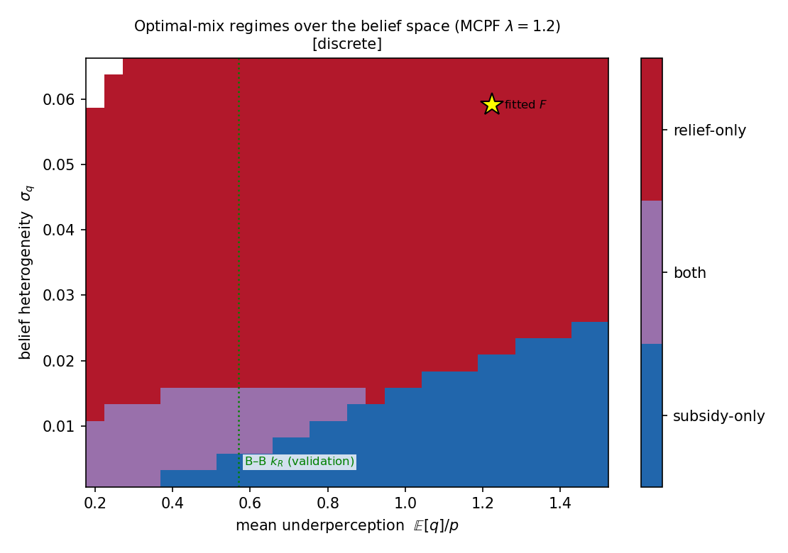
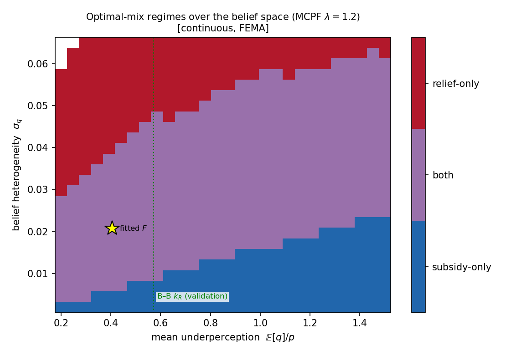

# MVPF Computations — formulas, results, and the optimal policy mix

## Headline: at the status quo, the marginal public dollar favors **disaster relief**

## 0. Setup

One-period, one-region model (draft.tex). Households with wealth $w$ face flood probability $p$ and
damage $d$; they differ in subjective probability $q\sim F$. The government has two instruments — an
insurance **subsidy** $s$ (insured pay $(1-s)pd$) and a **disaster-relief** fraction $a$ (uninsured
flood victims receive $a\,d$). A household insures iff $q>q^\ast(s,a)$; take-up $I=1-F(q^\ast)$. We
evaluate each instrument by its **MVPF** (marginal welfare gain per dollar of fiscal cost), and — using
the MCPF $\lambda$ as the benchmark — solve for the (secondary) optimal mix.

---

## 1. Utility and structural objects (discrete damage)

CRRA utility, $\gamma=2$:
$$u(c)=\frac{c^{1-\gamma}}{1-\gamma}=-\frac1c,\qquad u'(c)=c^{-\gamma}=\frac1{c^2}.$$

Consumption in each state (wealth normalized $w=1$):
$$c_I = w-(1-s)\,p\,d,\qquad c_{U,N}=w,\qquad c_{U,F}=w-(1-a)\,d.$$

Utility loss from an uninsured flood, and the take-up threshold belief:
$$\Delta u = u(c_{U,N})-u(c_{U,F}),\qquad q^\ast=\frac{u(c_{U,N})-u(c_I)}{\Delta u}.$$

A household insures iff its belief $q>q^\ast$. Note $q^\ast$ depends only on $(s,a)$ and the
structural parameters — **not on the belief distribution**.

## 2. Identification: sufficient statistics, then a fitted Beta

**Local (all the model needs for the headline).** The density of beliefs at the margin is recovered
from the observed take-up $I$ and premium elasticity
$\varepsilon \equiv (\pi/I)(\partial I/\partial\pi)$, $\pi=(1-s)pd$ (draft eq. fqstar):
$$\hat f \;=\; -\varepsilon\,\frac{I}{\pi}\,\frac{\Delta u}{u'(c_I)} .$$
$(I,\hat f)$ are all the belief information the MVPFs use. $\varepsilon = -0.32$ is G&S's
within-policy estimate imported under the relative-elasticity reading ("Reading A"; dual-reporting
Mulder's information-constant estimate is an open TODO).

**Global (secondary).** For counterfactuals away from the status quo the full $F$ is needed. The two
Beta parameters are exactly identified by the same two moments,
$$F_{Beta}(q^\ast)=1-I, \qquad f_{Beta}(q^\ast)=\hat f$$
(`code/belief_identification.py`; the fit is per damage model since $q^\ast,\Delta u$ differ).
Surveys (Bakkensen–Barrage's mean ratio $k_R=0.57$ and their "35% perceive ≤5% in 10 years"
quantile) are **validation checks, not inputs** — current results in §8 and
`model_parameters.md` §1d. Bounds/regions over the calibration set: TODO.

## 3. Take-up responses (draft eqs. dI_s / dI_a)

$$\frac{\partial I}{\partial s}=\frac{\hat f\,p d\,u'(c_I)}{\Delta u},\qquad
\frac{\partial I}{\partial a}=-\frac{\hat f\,q^\ast d\,u'(c_{U,F})}{\Delta u}.$$

## 4. MVPF formulas (value-function form, draft eqs. mvpf_s_vf / mvpf_a_vf)

With internality $\;(V_I-V_U)=(p-q^\ast)\Delta u\;$ and $pd\equiv p\cdot d$:
$$\boxed{\;\text{MVPF}_s=\frac{(p-q^\ast)\Delta u\cdot\frac{\partial I}{\partial s}+pd\,u'(c_I)\,I}
{pd\,I+pd\,(s-a)\frac{\partial I}{\partial s}}\;}$$
$$\boxed{\;\text{MVPF}_a=\frac{(p-q^\ast)\Delta u\cdot\frac{\partial I}{\partial a}+pd\,u'(c_{U,F})\,(1-I)}
{pd\,(1-I)+pd\,(s-a)\frac{\partial I}{\partial a}}\;}$$

- Numerator = **internality correction** $+$ **direct benefit** (transfer to recipients).
- Denominator = **direct fiscal cost** $+$ **fiscal externality** of switchers $(s-a)$.

## 5. Continuous-damage modification

Only the damage side changes ($d\to D\sim G$, mean $\bar d$). $G$ is the **empirical FEMA
claims-based distribution**: 20 bins of $D=$ damage$/$building value over single-family SFHA
claims since 2000, used at their conditional means with bin weights (expectations are exact
weighted sums; `configure_damage(empirical=…)`). Main variant: mean 0.3044, CV 0.99, 6.0% mass in
the top bin ($\bar D\approx0.993$); excl. Katrina (tail robustness): mean 0.2517, CV 1.02, 1.9%
top-bin mass. Note $\bar d$ is now the *empirical* mean, not `params.MEAN_D` = 0.15 — the
continuous and discrete specs are no longer mean-matched (provenance and caveats:
`model_parameters.md` §1b):
$$c_I=w-(1-s)p\bar d,\quad c_{U,F}(D)=w-(1-a)D,\quad
\Delta u=u(w)-\mathbb{E}[u(c_{U,F}(D))].$$
Define $\overline{Du'}\equiv\mathbb{E}[D\,u'(c_{U,F}(D))]$. Then $\partial I/\partial s$ uses $\bar d$,
$\partial I/\partial a=-\hat f q^\ast\overline{Du'}/\Delta u$, the relief direct benefit is
$\partial V_U/\partial a=p\,\overline{Du'}$, and $u'(c_{U,F})$ in MVPF$_a$ is replaced by
$\overline{Du'}/\bar d$. All $pd$ become $p\bar d$.

---

## 6. Parameter values used

| Symbol | Meaning | Value | Note |
|---|---|---|---|
| $\gamma$ | CRRA | 2 | Chetty |
| $w$ | wealth | 1 | normalized |
| $p$ | flood probability | 0.02 | ⚠ round modelling choice — discussion point (`model_parameters.md` §1b) |
| $d$ ($\bar d$) | damage / base | 0.15 (discrete); 0.3044 / 0.2517 (continuous, FEMA main / excl. Katrina) | discrete: G&S anchor; continuous: FEMA claim-ratio mean — specs no longer mean-matched |
| $s$ | subsidy rate | 0.47 | status quo (GAO) |
| $a$ | relief fraction | **0.10** | interim decision 2026-08-12; final choice TODO |
| $I$ | take-up | 0.30 | ⚠ discussion point (population); voluntary correction TODO |
| $\varepsilon$ | take-up elasticity | −0.32 | G&S, Reading A; Mulder dual-report TODO |
| $G$ | damage distribution | FEMA empirical 20-bin (CV 0.99 main / 1.02 excl. Katrina) | continuous only; replaces the Beta CV=0.86/1.3 placeholders (2026-08-18) |
| $\lambda$ | MCPF | 1.1–1.2 | enters only the global optimal mix (§8) |

Single source of truth: `code/params.py`. Full provenance: `model_parameters.md`.

**Structural objects at the status quo $(s,a)=(0.47,0.10)$:**

| | $c_I$ | $c_{U,F}$ | $\Delta u$ | $q^\ast$ | $u'(c_I)$ | $u'(c_{U,F})$ | $(p-q^\ast)\Delta u$ | $\hat f$ |
|---|---|---|---|---|---|---|---|---|
| **discrete** | 0.99841 | 0.86500 | 0.15607 | 0.01020 | 1.00319 | 1.33650 | 0.001529 | 9.39 |
| **cont. FEMA (main)** | 0.99677 | — (random) | 1.01902 | 0.00318 | 1.00648 | $\overline{Du'}/\bar d=23.119$ | 0.017140 | 30.12 |
| **cont. FEMA (excl. K)** | 0.99733 | — (random) | 0.59994 | 0.00446 | 1.00536 | $\overline{Du'}/\bar d=11.501$ | 0.009329 | 21.48 |

(discrete: $pd=0.003$, $\pi=0.00159$. FEMA main: $p\bar d=0.006088$, $\pi=0.003227$,
$\overline{Du'}=7.0377$. Excl. Katrina: $p\bar d=0.005034$, $\pi=0.002668$,
$\overline{Du'}=2.8943$. The huge $\overline{Du'}/\bar d$ values are driven by the total-loss
atom: at $a=0.10$ the top bin has $c_{U,F}\approx0.106$, $u'\approx89$.)

---

## 7. LOCAL results (headline) — sufficient-statistic MVPFs at the status quo

These need only $(I,\varepsilon)$; they are independent of the MCPF $\lambda$ and of the shape and
stability of $F$.

**Worked example — discrete.**
$$\hat f = 0.32\times\frac{0.30}{0.00159}\times\frac{0.15607}{1.00319}=9.393,$$
$$\frac{\partial I}{\partial s}=\frac{9.393\times0.003\times1.00319}{0.15607}=0.18113,\qquad
\frac{\partial I}{\partial a}=-\frac{9.393\times0.01020\times0.15\times1.33650}{0.15607}=-0.12312.$$

$$\text{MVPF}_s=\frac{0.001529\times0.18113+0.003\times1.00319\times0.30}
{0.003\times0.30+0.003\times0.37\times0.18113}
=\frac{0.0011798}{0.0011011}=\mathbf{1.072}.$$

$$\text{MVPF}_a=\frac{0.001529\times(-0.12312)+0.003\times1.33650\times0.70}
{0.003\times0.70+0.003\times0.37\times(-0.12312)}
=\frac{0.0026184}{0.0019633}=\mathbf{1.334}.$$

**Results across damage specifications** — MVPF$_a>$ MVPF$_s$ throughout:

| spec | $q^\ast$ | $\Delta u$ | $\hat f$ | **MVPF$_s$** | **MVPF$_a$** | ratio |
|---|---|---|---|---|---|---|
| discrete | 0.01020 | 0.156 | 9.39 | **1.072** | **1.334** | 1.24 |
| continuous FEMA (main) | 0.00318 | 1.019 | 30.12 | **2.212** | **31.44** | 14.2 |
| continuous FEMA (excl. Katrina) | 0.00446 | 0.600 | 21.48 | **1.736** | **13.60** | 7.8 |

MVPF$_s$ is close to 1 because insured households retain nearly all their wealth; MVPF$_a$ is higher
because uninsured flood victims are poorer, so their marginal utility is larger. The empirical
damage distribution lifts both MVPFs far above the old Beta-placeholder values (1.16/1.94 at
CV = 0.86) — relief enormously more, because relief additionally insures damage *dispersion*
($\overline{Du'}/\bar d \gg u'(c_{U,F}(\bar d))$) and the FEMA data put 6.0% (1.9% excl. Katrina)
of claim mass at near-total loss, where CRRA marginal utility explodes. **Honesty caveat
(calibration_decisions.md):** these magnitudes inherit the *linear, uncapped* pass-through of
damage to consumption — with a consumption floor / equity-cap loss function $\ell(\cdot)$ or a
capped-aid specification, the tail's contribution (and hence MVPF$_a$) would be materially
smaller. The excl. Katrina column shows the tail sensitivity directly. The *direction*
MVPF$_a>$ MVPF$_s$ survives every specification; the *magnitude* under the full tail does not yet.

*(Belief-input sensitivity — varying $(I,\varepsilon,p,a)$ over their candidate ranges rather than
any fitted parameter — is the planned bounds exercise; an open TODO. The former
$\nu$-sweep presentation is retired: under the fitted-Beta calibration the belief parameters are
exactly identified, so a sweep over them no longer has calibration meaning.)*

---

## 8. GLOBAL results (secondary) — fitted beliefs and the optimal mix

**Fitted belief distributions** (Beta fitted to $F(q^\ast)=1-I$, $f(q^\ast)=\hat f$; per damage
model):

| spec | Beta$(\alpha,\beta)$ | mean $m$ ($\times p$) | $\nu$ | $\sigma_q$ |
|---|---|---|---|---|
| discrete | (0.143, 5.69) | 0.0245 (1.22$p$) | 5.83 | 0.059 |
| continuous FEMA (main) | (0.143, 17.52) | 0.0081 (0.41$p$) | 17.66 | 0.021 |
| continuous FEMA (excl. Katrina) | (0.143, 12.59) | 0.0112 (0.56$p$) | 12.74 | 0.028 |

**Survey validation (checks, not inputs).** Against Bakkensen–Barrage's $k_R=0.57$, the fitted
means are 0.41$p$ (main) and 0.56$p$ (excl. Katrina) — the continuous mean check now **roughly
passes** (excl. Katrina almost exactly); the discrete fit (1.22$p$) still overshoots. The fitted
share with 10-year belief ≤5% is 0.64 (discrete) / 0.75 (main) / 0.71 (excl. Katrina) against
B–B's 0.35 (quantile check **overshoots**, more so under FEMA damages: mass below $p$ is
0.85–0.88, median 0.015–0.020$p$). The revealed-preference fit implies more extreme
under-perception than the elicitation — the identification discussion (Mulder over-ID test,
contamination share) is the designated home for this tension.

**Optimal policy mix** $(s^\ast,a^\ast)=\arg\max_{s,a} [S(s,a)-\lambda\,\text{cost}(s,a)]$ at the
fitted beliefs ($\lambda=1.0$ is degenerate — both MVPFs exceed 1 at the status quo, so the optimum
runs to the corner; reported values use the 101-point grid):

| spec | $\lambda=1.1$ | $\lambda=1.2$ |
|---|---|---|
| discrete | $s^\ast=0.00,\ a^\ast=0.62$ (relief-only) | $s^\ast=0.00,\ a^\ast=0.34$ (relief-only) |
| continuous FEMA (main) | $s^\ast=0.81,\ a^\ast=0.91$ (both) | $s^\ast=0.66,\ a^\ast=0.84$ (both) |
| continuous FEMA (excl. Katrina) | $s^\ast=0.72,\ a^\ast=0.89$ (both) | $s^\ast=0.46,\ a^\ast=0.80$ (both) |

The discrete optimum is relief-only, but under the empirical damage distribution the optimum funds
**both** instruments generously: the total-loss atom makes *complete* tail coverage — which only
insurance sells — valuable enough that a large subsidy pays alongside near-complete relief (the
pattern the old CV=1.3 robustness spec hinted at). A higher $\lambda$ shrinks the subsidy much
faster than relief. Same honesty caveat as §7: with capped aid or a consumption-floor loss
function the tail motive would weaken. **TODO:** replace these point results with bounds over the
surviving calibration set.

**Who relief reaches — the low-belief tail.** Relief serves the uninsured, deep-underperceiving
tail ($q<q^\ast$) — households that no affordable subsidy would pull into insurance. At the fitted
beliefs, the fraction no *free* subsidy could reach ($F(q^\ast_{s=1})$) is ≈0.29 in every damage
spec. This is why relief keeps a role even when subsidies are generous.



**Robustness over the whole belief space.** The phase diagram maps the optimal regime over
$(\mathbb{E}[q]/p,\ \sigma_q)$ — it does not depend on point-identifying the belief distribution.
The fitted $F$ is marked; relief-favored regimes cover most of the space, with subsidy-only
reserved for near-correct, tightly concentrated beliefs.





---

## 9. A note on complementarity (secondary)

We also asked whether the two instruments are formal *complements or substitutes*. The answer is a
**null / weak-substitutes** result and is **not** the headline:

- The welfare cross-partial $\partial^2 S/\partial s\,\partial a$ is **negative** (weak substitutes)
  across the empirical belief range.
- The welfare gain from optimally using **both** instruments, over the best single one, is
  **negligible** (order $10^{-5}$ of wealth, ≈\$1–2/household-year).

So the policy question is **which** instrument the marginal dollar should fund (answer: relief), and how
that depends on beliefs and the damage distribution — not a super-additive "complementarity" gain. The
detailed diagnostics and derivations are in `mvpf_complementarity.md` (on the `mvpf-complementarity`
branch). *(Numbers there predate the 2026-08-12 recalibration.)*

## 10. Verdict

- **Relief-favored, robustly.** At current US policy, MVPF$_a>$ MVPF$_s$ in every damage
  specification — a sufficient-statistic result independent of $\lambda$ and of the belief
  distribution's shape.
- **The empirical FEMA damage distribution strengthens this dramatically** — relief additionally
  insures damage dispersion, and the near-total-loss atom (6.0% main / 1.9% excl. Katrina) pushes
  MVPF$_a$ to 31 (14) vs MVPF$_s$'s 2.2 (1.7). *Magnitudes, not the ranking, hinge on the linear
  uncapped pass-through* — the loss-function/capped-aid variants (calibration_decisions.md) are
  the required honesty check before these numbers headline.
- **Relief's distinctive role** is reaching the low-belief uninsured tail that subsidies cannot.
- The global optimal mix at the fitted beliefs is relief-only in the discrete spec but funds
  **both** instruments under FEMA damages (complete tail coverage becomes valuable) at
  $\lambda\in\{1.1,1.2\}$ — graded lower-confidence pending the bounds TODO.
- The "complementarity" question is a secondary null (weak substitutes, negligible blend gain) —
  *computed under the retired placeholder calibration; worth re-checking under FEMA damages, where
  the optimal mix now funds both instruments.*

## 11. Open items

Mulder dual-report and over-identification test; voluntary-$I$ / mandate segment; population and
$p$; final $a$ and the benefit/cost wedge; global bounds. From the FEMA swap-in (done 2026-08-18):
**(p, G) consistency** — $G$ is claim-conditional, so adopt claim frequency per policy-year as $p$
(computable from the same database; `fema_data_analysis/notes/notes.md`); the **$\bar d$ gap**
(discrete 0.15 vs FEMA 0.3044 on a depreciated-building-value base) — reconcile via the utility
base / $\phi$-sweep; the **loss function $\ell(\cdot)$ and capped-aid variant**
(calibration_decisions.md Option 2C), which the tail-driven MVPF$_a$ magnitudes now make urgent.

---

## 12. How to reproduce

```python
import sys; sys.path.insert(0, "code")
import params, belief_identification as B
import mvpf_discrete as D, mvpf_continuous as C
import mvpf_optimal_mix as A

B.mvpf_local(D, D.S0, D.A0, params.I_OBS, params.EPS)   # -> (1.072, 1.334)
B.mvpf_local(C, C.S0, C.A0, params.I_OBS, params.EPS)   # -> (2.212, 31.445)  [FEMA main]
C.configure_damage(empirical=params.FEMA_DIST_EXCL_KATRINA)   # tail robustness
al, be = B.fit_beta(D, D.S0, D.A0, params.I_OBS, params.EPS)
B.validation(D, al, be)                                  # survey checks
A.optimal_mix(D, al/(al+be), al+be, lam=1.2)             # -> (0.00, 0.34)
```

Or run `python code/mvpf_reproduce.py` for all tables and the figures in
`figures/`, `figures_continuous/`, and `figures_continuous_excl_katrina/`.
